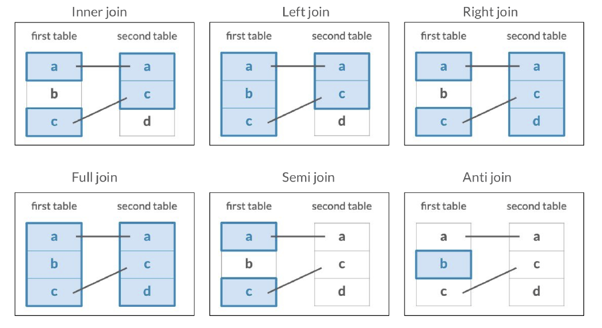

# R

```{r setup6, include = FALSE}
knitr::opts_chunk$set(echo = TRUE, warning = FALSE)
```

```{r, include=FALSE}
workingDir <-  "."
setwd(workingDir)
```

## Tipos de datos

Existen dos tipos de datos: atómicos y estructurados. Un dato atómico es aquel que se considera unidad mínima de información, como los números enteros y un dato estructurado es una colección de datos atómicos.

**Datos atómicos:**

  - **Lógico**: Datos que solo permiten los valores lógicos `TRUE` y `FALSE`.
  - **Numérico**: Datos cuyos valores son números reales.
  - **Complejo**: Datos cuyos valores son números complejos.
  - **Caracter**: Datos cuyos valores son cualquier tipo de carácter o cadena.
  
**Datos estructurados:**

  - **Arreglos**: colecciones multidimensionales de datos. 
  - **Vectores**: Arreglos unidimensionales. Cada uno de sus elementos es del mismo tipo.
  - **Matrices**: Arreglos de dos dimensiones. Todos sus datos son del mismo tipo.
  - **Dataframes**: Son arreglos de dos dimensiones. Los datos de una misma columna son del mismo tipo pero puede variar el tipo de dato en diferente columna.
  - **Listas**: colecciones unidimensionales de datos donde cada elemento puede ser de un tipo diferente.
  

En R, casi todo lo que se manipula son **objetos**. Cada objeto tiene sus propias características como tamaño, dimensiones, longitud, tipo y sus propias funciones. Los objetos más comunes en R son:

  - Vectores
  - Matrices
  - Arreglos
  - Listas
  - Dataframes

### Vectores en R  
  
Uno de los objetos más simples pero poderosos de R son los vectores. Los vectores son listas ordenadas de datos. Para crear un vector usamos la asignación `vector <- c("dato1", "dato2")`. Por ejemplo, `mi_vector <- c("hola", "clase", "1")`, en este caso el elemento `hola` es el primer elemento del vector, además todos los elementos son del mismo tipo *texto* que llamaremos **strings**. 

Podemos calcular la longitud de los vectores en R usando la función `length(vector)`.

```{r}
mi_vector <- c("hola", "clase", "1")
length(mi_vector)
```
Los elementos de los vectores los podemos llamar a través de índices. R siempre indexa desde el número 1 a diferencia de Python que indexa en 0. 

```{r}
mi_vector[1]
```

```{r}
#Ejercicio: Crea un vector de números enteros
```

En R podemos realizar operaciones vectorizadas, es decir se pueden aplicar las operaciones a cada elemento de nuestro vector. 

```{r}
#Ejercicio: Realiza la multiplicación del vector que creaste por el número 2.
```

En R la mayoría de las operaciones matemáticas están vectorizadas como la multiplicación, raíces, divisiones, logaritmos o exponenciales. 

```{r}
c(2,4,6)/2
```
```{r}
c(1,2,3)^2
```
Se pueden combinar también las operaciones vectorizadas e índices.

```{r}
mi_vector2 <- c(2,4,6)
mi_vector2[2]*5
```
Las sumas y restas tienen un comportamiento especial. 

```{r}
#Ejercicio: Crea dos vectores de la misma longitud y súmalos. 
#¿Qué realiza la suma de vectores? 
#¿Qué pasa si sumas vectores de diferente longitud?
```

Otras operaciones vectorizadas son las comparaciones. Los operadores de comparación que podemos usar en R son los siguientes:

  - `==` para ver igualdad.
  - `!=` para ver diferencia.
  - `>=` para ver si el lado izquierdo es mayor o igual que el derecho.
  - `<=` para ver si el lado izquierdo es menor o igual que el lado derecho.
  - `>` para ver si el lado izquierdo es mayor que el lado derecho.
  - `<` para ver si el lado izquierdo es menor que el lado derecho.
  
```{r}
-1 <= 9 
```
```{r}
c(1,2,3) == c(1,2,4)
```
Si tenemos dos expresiones lógicas, podemos usar también los siguientes operadores:

  - `&` es la conjunción.
  - `|` es la disyunción.
  - `!` es la negación.
  
```{r}
2 < 3 & 4> 1
```
```{r}
! 2 < 3
```
Las sequencias regulares se pueden formar con el operador `:`.
```{r}
x <- 1:3
x
```
El operador `:` tiene prioridad sobre otros operadores.

```{r}
#Ejercicio: ¿Qué obtenemos al realizar y <- 1:5-3?
```

Para formar una sequencia de números reales se usa la función `seq`, la sintaxis es como sigue: `seq(from= 1, to=n, by=k, length.out = NULL )`,

```{r}
seq(from=1, to=40, by=5)
```
```{r}
seq(0, 1, by=0.1)
```
```{r}
#Ejercicio: ¿Qué pasa si invertimos el orden de las entradas en la función `seq`?
# seq(by=2, to=10, from=1)
```

La función `seq` se puede combianar con la creación de vectores.

```{r}
x <- c(1, 2, 3, seq(4, 10, by=0.5))
#¿Cuál es la longitud del vector x?
#length(x)
```
Otra función que es útil para crear vectores es `rep(Z,n)`, esta función crea un vector de `n` elementos todos iguales a `Z`.

```{r}
y <- rep(2,10)
y
```
```{r}
z <- c(x, y)
z
```
Las variables se pueden reescribir.
```{r}
y <- c(y, "hola")
y
```
```{r}
#Ejercicio: ¿Qué sucedió con el vector y? 
#¿De que tipo son sus elementos ahora?
#Realizar la operación y+2.
```

Podemos convertir objetos de un tipo a otro compatible usando las funciones `as.(nombre_del_nuevo_tipo_de_objeto)`. Por ejemplo, nuestro vector `y` ahora es del tipo caracter, podemos quitar el elemento que es de tipo caracter y convertirlo a un nuevo objeto ahora de tipo numérico.

```{r}
y[11]
w <- as.numeric(y[1:10])
```

```{r}
as.numeric(TRUE)
```
Las funciones elementales como `exp`, `log`, `sin`, etc las podemos aplicar a los vectores siempre y cuando los elementos de nuestro vector estén en el dominimo de la función correspondiente. 

```{r}
log(c(1,2,4))
```
```{r}
(Logaritmo<-log(c(-1,2,3)))
```
Otras funciones útiles para vectores son:

  - `max(x)` y `min(x)`: elemento máximo y mínimo del vector $x$.
  - `sum(x)` y `prod(x)`: nos devuelve la suma y producto de los elementos del vector $x$.
  - `mean(x)` y `var(x)`: nos devuelve la media y varianza del vector $x$.
  - `sort(x)`: ordena los elementos del vector $x$ de manera creciente. Si agregamos el argumento `decreasing=TRUE` los ordena de mayor a menor.
  - `order(x)`: nos da los índices correspondientes al ordenamiento de los elementos de $x$ de menor a mayor.

```{r}
sort(c(6,2,9,10,4))
```
```{r}
order(c(6,2,9,10,4))
```
```{r}
sort(c(6,2,9,10,4), decreasing = TRUE)
```

```{r}
sum(c(6,2,9,10,4)); prod(c(6,2,9,10,4))
```
```{r}
mean(c(6,2,9,10,4)); var(c(6,2,9,10,4))
```
Podemos también seleccionar elementos de un vector y cambiarlos.

```{r}
x <- seq(1,10,1)
x[c(2,4,6,8,10)] <- 0
x
```
```{r}
x[c(3,5)]<-c(2,4)
x
```
En el caso de vectores de caracteres, dos funciones que son útiles son `substr()` y `substring()` las cuales nos sirven para extraer cierta cantidad de caracteres de cada entrada del vector. La sintaxis es la siguiente: `substr(x,inicio,final)` y `substring(x,inicio,last=1000000L)`. 

```{r}
clases <- c("01.Matemáticas", "02.Español", "03.Ciencias", 
            "04.Física", "05.Geografía")
substring(clases,4,last=1000000L)
```
```{r}
substr(clases,1,2)
```
La función `names()` nos ayuda a darle un nombre a las entradas de los vectores, es decir en lugar de índices númericos ahora podemos asignarle un nombre a cada entrada.

```{r}
mis_calificaciones <- c(10,8,9,7,8)
names(mis_calificaciones)
```
```{r}
names(mis_calificaciones) <- c("Matemáticas", "Español", "Ciencias", "Física", "Geografía")
```

```{r}
names(mis_calificaciones)
```
```{r}
mis_calificaciones
```

### Arreglos

Un **array** es una colección de datos, todos del mismo tipo, indexada por varios índices, es decir son objetos multidimensionales en R. 

Si $dim=c(x_1,x_2,x_3...)$, donde $x_1$, $x_2$, $x_3$, etc son enteros, entonces $x_1$ es el número de filas, $x_2$ es el número de columnas, $x_3$ es el número de capas del array.

Una forma de crear arrays es primero crear un vector y después pasarle las dimensiones del arreglo.

```{r}
x <- c(1:60)
# las dimensiones del array serán 6 filas y 10 columnas
dim(x) <- c(6,10)
dim(x)
```
La función `array()` resume estas dos instrucciones. Su sintáxis es la siguiente: `array(vector, dim = dimensiones)`.

```{r}
# crea directo el array indicando vector y dimensiones
y <- array(c(1:60), dim = c(6,10))
y
```
La función `class(objeto)` nos permite conocer el tipo de objeto con el que estamos trabajando.

```{r}
class(x)
class(y)
```

```{r}
#Ejercicio: crear otro array z con el mismo vector x y 3 dimensiones y verifica el tipo de objeto que es z.
```

Las funciones `ncol()` y `nrow()` nos permiten conocer cuantas columnas y filas tienen los arrays en cada una de sus capas.

```{r}
ncol(x)
nrow(x)
#ncol(z)
#nrow(z)
```
Como la función `dim()` nos dice las dimensiones de nuestro objeto, las funciones anteriores son equivalentes a lo siguiente:

```{r}
# Número de filas
dim(z)[1]
# Número de columnas
dim(z)[2]
# Número de capas
dim(z)[3]
```
Al igual que con los vectores, también podemos mandar a llamar las entradas del array indicando dentro de corchetes los índices. Si una dimensión se omite, R lo interpreta como que se piden todos los elementos de esa dimensión.

```{r}
y[1,2]
```
```{r}
y[1,]
```
```{r}
#Ejericio: Extrae la entrada (2,1,1) del arreglo z que creaste anteriormente.
```

Un array puede utilizar también otro array de índices, tanto para asignar un vector a una colección irregular de elementos de un array como para extraer una colección irregular de elementos.

```{r}
indices <- array(c(1:6,1:6), dim=c(6,2))
indices
```
```{r}
# Asignamos el valor de 0 a las entradas dadas por el array indices
x[indices] <- 0
x
```

También podemos modificar manualmente las entradas del array de la siguiente forma.

```{r}
x[5,7] <- 0; x[4,8]<- 0; x[3,9]<- 0; x[2,10] <- 0
x
```
La función `which()` nos ayuda a recuperar los índices de un array que cumplan alguna condición. Su sintaxis es `which(object, arr.ind = FALSE)`, donde `object` es el objeto de donde se quiere recuperar los índices y `arr.ind` se cambia a `TRUE` si se requieren los índices multidimensionales.

```{r}
which(x<1, arr.ind = TRUE)
```
Está función también se puede aplicar a vectores. 

```{r}
(Logaritmo<-log(c(1,-2,3)))
which(Logaritmo=="NaN")
```
Las funciones y operaciones de los arrays son similares a las de los vectores.

```{r}
# Sacar raíz cuadrada de la columna 1 del vector x
raiz_x <- sqrt(x[,1])
raiz_x
```
```{r}
#Ejercicio: Cambiar la columna 3 del array x por sus cuadrados.
```

La función `dimnames` es similar a la función `names()` de los vectores. En el caso de arrays, `dimnames` será una **lista** que debe contener tantos vectores como dimensiones tenga el array.

```{r}
mi_array <- array(c(1:12), dim=c(2,2,3),
                  dimnames = list(c("Gato","Perro"),
                                  c("Esterilizado", "No esterilizado"),
                                  c("Morelia", "Patzcuaro", "Maravatio")))
mi_array
```
```{r}
# Obtener la cantidad de gatos no esterilizados en Morelia
mi_array[1,"No esterilizado", "Morelia"]
```
```{r}
mi_array["Perro",,c("Morelia","Patzcuaro","Maravatio")]
```
```{r}
#Ejercicio: Cambia el nombre de la ciudad Maravatio por alguna otra.
```

Las funciones `rbind()` y `cbind()` sirven para combinar arrays vertical y horizontalmente.

```{r}
mi_array1 <- array(c(1:6), dim = c(2,3))
mi_array2 <- array(c(7:18), dim = c(4,3))
mi_array3 <- array(c(19:29), dim = c(2,5))
```

```{r}
rbind(mi_array1, mi_array2)
```
```{r}
cbind(mi_array1, mi_array3)
```

### Matrices

Las **matrices** son arreglos de dos dimensiones. Entonces, una forma de crear una matriz es usando la función `array` pero especificando una dimensión de la forma `dim=c(x,y)`. 

```{r}
matriz1 <- array(c(1:9), dim = c(3,3))
matriz1
```
Otra forma de crear matrices es usando la función `matrix()` indicandole el número de columnas y/o filas.

```{r, echo=FALSE}
matriz2 <- matrix(c(1:9), ncol=3)
matriz2
```
```{r}
class(matriz1);class(matriz2)
```

```{r}
matriz_ceros <- matrix(0, ncol=5, nrow=3)
matriz_ceros
```

Otro parámetro que podemos darle a la función `matrix` es `byrow`, el cual nos ayuda a llenar la matrix por filas.

```{r}
matriz3 <- matrix(c(1:9), nrow = 3, byrow = TRUE)
matriz3
```
Como las matrices son un tipo particular de los arreglos, las funciones como `dimnames` o extraer entradas y modificarlas funcionan de la misma forma.

```{r}
#Ejercicio: Crea una matriz de tamaño 4x4 con números consecutivos ordenados 
#por filas y extrae la entrada (4,2).
#cambia los nombres de las filas y columnas por caracteres
```

Disponemos también de varias operaciones con matrices. La operación $A\ast B$ donde $A$, $B$ son matrices en R se refiere a la multiplicación entrada a entrada, no a la multiplicación de matrices. Además esta multiplicación solo se puede realizar si se tiene el mismo número de filas y de columnas.

```{r}
matriz2 * matriz3
```
La suma y resta de matrices se refiere a sumar o restar dos matrices entrada a entrada, solo se puede realizar con matrices de las mismas dimensiones.

```{r}
# Suma
matriz2 + matriz3
```

```{r}
# Resta
matriz2 - matriz3
```

El operador en R para realizar la multiplicación usual de matrices es `%*%`.

```{r}
matriz2 %*% matriz3
```
El operador `t()` se usa para calcular la transpuesta de una matriz.

```{r}
t(matriz1)
```

#### Otras operaciones con Matrices

  - **Crossproduct**: es equivalente a `t(A)%*% B` o `A %*% t(B)`. Las funciones que se usan son `crossprod` y `tcrossprod` respectivamente.
```{r}
A <- matrix(c(10,8,5,12), ncol = 2, byrow = TRUE)
B <- matrix(c(5,3,15,6), ncol = 2, byrow = TRUE)
```

```{r}
crossprod(A,B)
```
```{r}
tcrossprod(A,B)
```
  - **Producto exterior**: El operador que se usa es `%o%` o la función `outer()`.
  
```{r}
A %o% B
```
```{r}
outer(A, B, FUN = "*")
```
  - **Producto Kronecker:** si $A$ y $B$ son dos matrices, el producto de Kronecker se denota por $A \otimes B $ y en R el operador correspondiente es `%x%`.
  
```{r}
A %x% B
```
  - **Potencia de una matriz:** existen dos formas de realizarla. La primera es con el operador `%^%` del paquete `expm`. La segunda con la función `matrix.power` del paquete `matrixcalc`.

```{r}
#install.packages("expm")
library(expm)
A %^% 2
```
```{r}
#install.packages("matrixcalc")
library(matrixcalc)
matrix.power(A,2)
```  
  - **Determinante:** la función de R que calcula el determinante de una matriz es `det()`.
```{r}
det(A)
det(B)
```
  - **Inversa:** para calcular la inversa de una matriz se usa la función `solve()`.
  
```{r}
solve(A)
```
```{r}
#Ejercicio: Verifica que efectivamente solve(A) es la inversa de la matriz A.
```

La función `solve` también nos ayuda a resolver un sistema de ecuaciones, por ejemplo si queremos resolver el sistema de ecuaciones $AX = B$ lo podemos hacer de la siguiente manera.
```{r}
solve(A, B)
```
  - **Rango:** no existe una función base de R para calcular el rango pero se puede usar la función `qr()` que nos calcula la descomposición QR de una matriz y regresa también como argumento el rango de la matriz o la función `rankMatrix` del paquete `Matrix`.
```{r}
qr(A)
```
Para solo pedir a R el rango de la matriz se hace uso del operador `$` de la siguiente manera.
```{r}
qr(A)$rank
```
```{r}
library(Matrix)
rankMatrix(A)[1]
```
  - **Matriz diagonal**: La función `diag()` nos ayuda a extraer o reemplazar la diagonal de una matriz.
```{r}
#extraer la diagonal
diag(A)
```
```{r}
# reemplazar la diagonal
#diag(A) <- c(0,2)
```

Si el argumento que se le da a la función `diag` es un vector, esto crea una matriz diagonal con las entradas del vector en la diagonal.
```{r}
diag(c(1,2,3))
```
Además, la función `diag` también nos permite crear una matriz identidad especificando solamente la dimensión de la matriz deseada.

```{r}
diag(3)
```
  - **Eigenvalores y eigenvectores**: la función de R que nos calcula tanto los eigenvalores como los eigenvectores es `eigen()`.
  
```{r}
eigen(A)
#Para obtener solo los eigenvalores en orden decresiente 
#eigen(A)$values
#Para obtener solo los eigenvectores
#eigen(A)$vectors
```

### Dataframes

Los dataframes o tablas de catos son un arreglo rectangular de datos y son los objetos más usados en R al momento de realizar análisis de datos. En los vectores, arreglos y matrices, todas las entradas tienen que ser el mismo tipo de dato pero en los dataframes no es necesario pero cada columna si debe de tener el mismo tipo de datos. 

Para crear un dataframe usamos la función `data.frame()`, a diferencia de los arrays, uno debe especificar cada columna con su nombre. Los nombres de las columnas no deben de contener espacios.

```{r}
mi_df <- data.frame(ciudad = c("Morelia", "Veracruz", "Merida"),
                    Temperatura = c(27, 26, 32),
                    Playa = c(FALSE, TRUE, FALSE))
mi_df
```
Todas las columnas de un dataframe deben de tener la misma longitud. La función `str()`nos permite ver como están estructurados nuestros datos, no solamente un dataframe.

```{r}
str(mi_df)
```
En los dataframes, las filas también pueden tener un nombre, para darles nombre usamos la función `row.names()`.

```{r}
row.names(mi_df) <- c("A", "B", "C")
mi_df
```

El comando `row.names()` se puede dar como atributo cuando se construye el dataframe.

```{r}
mi_df <- data.frame(ciudad = c("Morelia", "Veracruz", "Merida"),
                    Temperatura = c(27, 26, 32),
                    Playa = c(FALSE, TRUE, FALSE),
                    row.names = c("A", "B", "C"))
mi_df
```

Para acceder a los datos del dataframe es similar a la forma de los arreglos o vectores y además podemos mandar a llamar solo una columna usando el operador `$`.

```{r}
mi_df$ciudad
```
```{r}
mi_df[,2]
```
```{r}
mi_df[c("A","B"),]
```
```{r}
#Cambiar la temperatura de Veracruz
mi_df[2,2] <- 33
mi_df
```

Una forma de modificar el nombre de una columna de nuestro dataframe es con la función `names`.

```{r}
names(mi_df)[1] <- "Ciudad"
mi_df
```


Las funciones `rbind` `cbind` que usamos con los arreglos también se pueden usar para expandir los dataframes. 

```{r}
nuevo_df <- data.frame(c("Monterrey", "Cancún"), c(25, 28), c(FALSE, TRUE))
nuevo_df
```

```{r}
#rbind(mi_df, nuevo_df)
```

Al no tener los mismos nombres de **columnas**, no se puede usar `rbind` para combinarlos. Esto se puede solucionar cambiando los nombres del segundo dataframe.

```{r}
colnames(nuevo_df)
```
```{r}
colnames(nuevo_df) <- colnames(mi_df)
colnames(nuevo_df)
```
```{r}
rbind(mi_df, nuevo_df)
```
Con `cbind` no tenemos este problema ya que lo que hacemos es agregar columnas.

```{r}
info_extra <- data.frame(Habitantes = c(849053, 8063000, 892363)) 
cbind(mi_df, info_extra)
```

Otra forma de agregar una columna es con el operador `$`. 

```{r}
mi_df$Habitantes <- c(849053, 8063000, 892363)
mi_df
```

El operador `$` también nos sirve para eliminar una columna. 

```{r}
mi_df$Habitantes <- NULL
mi_df
```

Para guardar un dataframe usamos la función `write.csv`.

```{r}
write.csv(mi_df, file = "D:/Users/hayde/Documents/R_sites/Seminario_Estadistica/data/municipios.csv", row.names = FALSE)
```

Para leer el csv que acabamos de guardar usamos la función `reaf.csv`.

```{r}
municipios <- read.csv(file = "D:/Users/hayde/Documents/R_sites/Seminario_Estadistica/data/municipios.csv", stringsAsFactors = TRUE)
municipios
```

```{r}
municipios$ciudad
```

### Listas

Las listas son objetos ordenados de una solo longitud y sus elementos pueden ser de distinto tipo, incluso otras listas. La función para crear listas es `list()`. 

```{r}
mi_lista <- list(1,"a", TRUE)
mi_lista ; class(mi_lista) ; typeof(mi_lista)
```
Para acceder a los elementos de una lista es similar a la de los vectores e incluso se le puede dar nombres a las entradas o modificarlos como con los vectores usando la función `names()`.

```{r}
mi_lista2 <- list(mi_vector = c(1,2,3,4),
                  mi_array = array(c(1:9),dim=c(3,3)),
                  mi_booleano = TRUE)
mi_lista2
```

```{r}
names(mi_lista2)
```
```{r}
names(mi_lista2)[3] = "mi_logico"
names(mi_lista2)
```
No es necesario que todas las entradas de la lista tengan los mismos nombres. 
```{r}
mi_lista3 <- list(c(1:3),letra = "a", c(TRUE,FALSE))
names(mi_lista3)
```
La función `length()` nos devuelve la dimensión de una lista.
```{r}
length(mi_lista2) ; length(mi_lista3)
```
Con la función `srt()` podemos conocer la estructura de la lista.
```{r}
str(mi_lista2)
```
A diferencia de los vectores y arrays, en las listas contamos con dos niveles de indexado. Con dobles corchetes accedemos a los elementos de la lista, es decir `[[n]]` nos devuelve el elemento $n$ de la lista y en caso de que se trate de un array, vector u otro objeto para acceder a los elementos de este objeto usamos otros corchetes, es decir `objeto[[n]][p]`. 
```{r}
# Para acceder a la primera fila de la segunda entrada de la lista, la cual es 
# un array usamos:
mi_lista2[[2]][1,]
```
```{r}
class(mi_lista2[[2]])
```
```{r}
mi_lista2[2]
```

```{r}
class(mi_lista2[2])
```
Otra forma de acceder a los objetos de la lista es usando sus nombres o con el operador `$` como en los dataframes.
```{r}
mi_lista2["mi_vector"]
```
```{r}
mi_lista2[["mi_vector"]]
```

```{r}
mi_lista2$mi_array
```

Para añadir elementos a una lista debemos ser cuidadosos con los índices que usamos, si usamos `[[k]]` estaríamos añadiendo un objeto en la posición $k$ de la lista y si usamos `[[k]][j]` estaríamos añadiendo el elemento $j$ al objeto $k$ de la lista.

```{r}
mi_lista[[4]] <- c("a","b","c")
mi_lista
```
```{r}
mi_lista[[1]][2] <- 2
mi_lista
```
Para eliminar elementos de una lista podemos asignar `NULL` a la posición de la lista, sin embargo esta asignación no hace diferencia de si usamos `[[]]`, `[]` o `$`.

```{r}
mi_lista4 <- list(c(1,2,3,4),array(c(1:4),dim = c(2,2)), c(TRUE,FALSE))
mi_lista4
```
```{r}
mi_lista4[1] <- NULL
mi_lista4
```

```{r}
mi_lista4 <- list(c(1,2,3,4),array(c(1:4),dim = c(2,2)), c(TRUE,FALSE))
mi_lista4[[1]] <- NULL
mi_lista4
```
```{r}
mi_lista4 <- list(mi_vec = c(1,2,3,4),mi_array = array(c(1:4),dim = c(2,2)), mi_log = c(TRUE,FALSE))
mi_lista4[["mi_array"]] <- NULL
mi_lista4
```
```{r}
mi_lista4 <- list(mi_vec = c(1,2,3,4),mi_array = array(c(1:4),dim = c(2,2)), mi_log = c(TRUE,FALSE))
mi_lista4["mi_array"] <- NULL
mi_lista4
```
```{r}
mi_lista4 <- list(mi_vec = c(1,2,3,4),mi_array = array(c(1:4),dim = c(2,2)), mi_log = c(TRUE,FALSE))
mi_lista4$mi_array <- NULL
mi_lista4
```
```{r}
mi_lista4 <- list(mi_vec = c(1,2,3,4),mi_array = array(c(1:4),dim = c(2,2)), mi_log = c(TRUE,FALSE))
mi_lista4[c(1,3)] <- NULL
mi_lista4
```
```{r}
mi_lista4 <- list(mi_vec = c(1,2,3,4),mi_array = array(c(1:4),dim = c(2,2)), mi_log = c(TRUE,FALSE))
mi_lista4[-c(1,3)] 
```
Para combinar dos listas usamos el operador que se usa para concatenar vectores `c()`.

```{r}
lista1 <- list(c(1,2,3),c("a","b"))
lista2 <- list(array(c(1:4),dim=c(2,2)), c(TRUE,FALSE))
```

```{r}
lista3 <- c(lista1, lista2)
lista3
```
```{r}
class(lista3)
```
```{r}
#Ejercicio: Crea una lista y concatenala con la lista mi_lista3. Modifica la entrada 3,1 y el nombre de la entrada 2 de la lista.
```

### Factores

Los factores nos ayudan a representar los niveles de los datos, pueden parecer caracteres pero en realidad son niveles. Por ejemplo, se pueden usar para representar el género, continentes, razas de algún animal, etc.

```{r}
gatos <- c("Siames", "Calico", "Angora", "Carey")
str(gatos)
```
```{r}
categorias_gatos <- factor(gatos)
class(categorias_gatos)
```
```{r}
str(categorias_gatos)
```
```{r}
typeof(gatos); typeof(categorias_gatos)
```
Para conocer los niveles de nuestro objeto usamos la función `levels()` y cuantos niveles tenemos `nlevels()`.

```{r}
levels(categorias_gatos); nlevels(categorias_gatos)
```
Los factores se ordenan alfabéticamente. 

```{r}
niveles <- c("alto", "medio", "bajo")
factor(niveles)
```
```{r}
factor(niveles, order = TRUE, levels = c("bajo", "medio", "alto"))
```
```{r}
niveles2 <- factor(niveles, order = TRUE, levels = c("bajo", "medio", "alto"))
niveles2; as.numeric(niveles2)
```

### Atributos de objetos 

Los atributos de los objetos los podemos obtener de la siguiente forma:
  - **Modo**: Cualquier tipo de entidad que maneja R, se usa la función `mode(objeto)`.
  - **Tipo**: Tipo de dato: entero, caracter, double, etc. Se usa la función `typeof(objeto)`.
  - **Nombres**: etiquetas de los elementos individuales de un vector o lista. Se usa la función `names(objeto)`.
  - **Dimensiones**: Dimensión de los arreglos. Se usa la función `dim(objeto)`. Esta función devuelve dos valores: el primero es el número de filas, el segundo el de columnas.
  - **Dimnames**: Nombres de las dimensiones de los arrays. Se usa la función `dimnames(objeto)`.
  - **Clase**: Vector alfanumérico con la lista de las clases del objeto. Se usa la función `class(objeto)`.
  - **Longitud**: Longitud de cualquier estructura. Se usa la función `length(objeto)`.

  
```{r}
typeof(mi_vector)
```
El operador `ls()` nos permite listar todas las variables y funciones de nuestro ambiente global, sin embargo los objetos que comienzan con `.` no son listados, para listar estas variables se utiliza `ls(all.names = TRUE)`.

```{r}
ls()
```

Para borrar un objeto usamos `rm(objeto)`. 

```{r}
rm(mi_vector)
```

En el caso de querer eliminar todos los objetos de nuestro ambiente, usamos `rm(list = ls() )`. Es importante señalar que se debe usar el operador `=` para asignar al objeto `list` todos los objetos que estén en `ls()` en lugar del operador `<-`.

### Ejercicios

1. Crea una base de datos de los asistentes a la clase y dale el nombre `estudiantes`, almacena datos como nombre, edad, lugar de origen, grado, o algunos otros de tal forma que la base de datos tenga variables de todos los tipos, numéricos, factores, lógicos y caracteres. 

  (a) Usando la base de datos estudiantes, extrae las columnas de los estudiantes con edad mayor al promedio de las edades y aquellos estudiantes del mismo grado.
  (b) Extrae las ciudades o regiones de aquellos estudiantes mayores a la edad promedio.
  (c) Ordena la base de datos usando alguna variable cuantitativa.
  (d) Crea una lisa con los elementos de la base de datos estudiantes y da un nombre a las entradas de la lista y accede a tu nombre y edad como subelementos de la lista.
  
2. Usando la ayuda de R, busca como se pueden redondear los números $2.5$, $4.8$, $9,2$. ¿Cuáles fueron los resultados de redondear? Ahora, trata de redondear a dos decimales los siguientes números: $4.765$, $3.231$, $9.769$. 

3. Crea una vector con las letras `A M A B M M B A B B`, donde `A` significa Alto, `B` bajo y `M` medio. Convierte las entradas del vector a factores y especifica que `A > M > B`.

4. Carga la base de datos `CO2` del paquete `datasets` usando `data("CO2")`. Explora la base de datos y revisa que tipo de datos tiene cada columna. 

  (a) Calcula el promedio de las tasas de absorción de CO2 en Quebec (`uptake`).
  (b) Obtén el máximo y mínimo de las concentraciones de CO2 para las plantas `chilled`.
  (c) Para las plantas `Ms2`, ¿cuántos niveles de concentración ambiental de CO2 se midieron?.
  (d) Para plantas `non-chilled`, cuando la concentración es 500, ¿cuáles son los niveles de absorción `uptake`?
  

## Estructuras de control

Las estructuras de control se refieren a como hacemos que un algoritmo tome alguna decisión o camino dependiendo de las condiciones que se le especifiquen y realice ciclos o repeticiones. 

Vamos a ver dos tipos de estructuras de control. La primera el condicional `if` donde ciertas instrucciones son ejecutadas dada la veracidad de la condición que actúa como un parámetro de control. La segunda se trata de los ciclos, los cuales repiten ciertas instrucciones varias veces, de este tipo de estructuras de control tenemos el ciclo `for` que se usa cuando las repeticiones se realizan un número fijo de veces (el parámetro de control) y el ciclo `while` cuando las iteraciones no se especifican a priori pero continua evaluándose mientras alguna condición no se alcance.

### Condicional `if`

La palabra clave `if` siempre evalúa una expresión lógica y cuando dicha expresión de por resultado el valor `TRUE`, se ejecutará el código indicado a continuación del `if` entre llaves. En caso de que el resultado sea `FALSE`, ignorará lo que se encuentre inmediatamente del `if` entre llaves y continuará con la siguiente instrucción.

```{r, eval = FALSE}
# if
if (condicion es TRUE) {
  instrucción
}

# if ... else
if (condicion es TRUE) {
  instrucción
} else {
  instruccion alternativa
}

# if ... else if ... else
if (condicion es TRUE) {
  instrucción
} else if (condicion es TRUE) {
  instruccion alternativa
} else {
  ultima condicion
}
```

Por ejemplo, vamos a crear una variable y asignarle un valor, después vamos imprimir en pantalla si la variable tiene cierto valor.

```{r, message=FALSE}
x <- 8

if (x >= 10) {
  print(" x es más grande o igual a 10")
}
x
```
Como $x$ no es más grande que 10, entonces no nos devuelve ningún mensaje.

```{r, message=FALSE}
x <- 8

if (x >= 10) {
  print(" x es más grande o igual a 10")
} else {
  print(" x es menor que 10")
}
x
```
Para verificar varias condiciones podemos usar `else if`
```{r, message=FALSE}
x <- 8

if (x >= 10) {
  print(" x es más grande o igual a 10")
} else if (x > 5) {
  print("x es mayor que 5 pero menor que 10")
} else {
  print(" x es menor que 10")
}
x
```
```{r, eval=FALSE}
edad <- readline(prompt = "Escribe tu edad:")

if (edad >= 30 ) {
  print("Tal vez tenemos la misma edad")
} else{
  print("Soy mayor que tu")
}
```

```{r}
# Ejercicio: crea un ciclo if que pregunte un número y que devuelva el mensaje de si el número es positivo, negativo o cero.
```

También se pueden crear ciclos anidados. 

```{r, eval=FALSE}
dato_texto = readline(prompt="Ingresa un número: ")
dato  <- as.numeric(dato_texto)
if(is.na(dato) == FALSE){
    print('Es un número.')
    if(dato < 0){
        print('Es negativo.')
    } else if(dato > 0){
        print('Es positivo.')
    } else{
        print('Es cero')
    }
} else{
    print('No es un número.')
}
```

```{r}
#Convierte el if anidado anterior en uno no anidado.
```

Existe una función adicional llamada `ifelse()`, la estructura de esta es `ifelse(condicion is TRUE, instruccion1, instruccion alternativa)`.

```{r}
x <- -2

ifelse(x < 0, "x es un número negativo", "x es un número positivo o cero")
```

Tres funciones que son de gran ayuda para verificar condiciones son `all()`, `any()`, `which()`. 

```{r}
edades <- c(12, 11, 24, 30, 5, 27, 12)

all(edades >= 25) ; any(edades == 30); which(edades == 12)

```

### Ciclo `for`

La función `for()` realiza un bloque de códigos tantas veces como se indique un argumento. Los objetos de tipo iterable, es decir los que se pueden recorrer son los vectores y las listas. La sintaxis de un `for` es la siguiente:
```{r, eval=FALSE}
for (contador in vector_indices){
  instrucciones a ejecutar
}
```

El vector de índices se define antes de las instrucciones entre `{}` o dentro de los `()`. Por ejemplo,

```{r}
for (i in 1:10){
  print(i)
}
```
Al terminar el ciclo `for()`, el valor de la varible `i` toma el último valor de la lista de índices.

```{r}
i
```
Vamos a crear un vector vacío y que después se rellene con la suma acumulativa de los enteros consecutivos en el vector.

```{r}
vec <- c()
vec 
```
```{r}
s <- 0
for (i in 1:10){
  s <- s + i
  vec[i] <- s
}
vec
```
```{r}
impares <- 2*(1:10)-1

for (i in impares){
  print(i)
}
```
También se pueden usar valores lógicos como sigue.

```{r}
for (i in c(TRUE, FALSE, TRUE)){
  print(TRUE == i)
}
```
Las estructuras de control se pueden combinar. Por ejemplo, vamos a crear un condicional con un `for` y un `if` que nos regrese el mensaje de si un estudiante alcanzó al menos 5 puntos en un examen.

```{r}
puntos <- c(10,4, 6,2,4, 7, 5, 9, 8, 0)
for (puntaje in puntos){
  if (puntaje < 5 ){
    print("Reprobó")
  } else {
    print("Aprobó")
  }
}
```
```{r}
# Ejercicio: crea un ciclo para calcular el factorial de un número.
# Hint: usa un if y un for anidados y define dos variables n<-número al cúal se le va a calcular el factorial y fac <- iniciala en 1 y esa será el resultado del factrorial de n.
```


### Ciclo `while`

El ciclo `while()` se usa para realizar un bloque de código recursivamente mientras no se alcance cierta condición. Si el resultado de la evaluación es `FALSE` entonces no se realizará la instrucción. La estructura del condicional `while()` es como sigue.

```{r, eval=FALSE}
while(expresion logica){
  instrucciones a ejecutar
}
```

El siguiente ejemplo imprime en pantalla un número mientras este no sea mayor a 10.

```{r}
i <- 0
while (i < 10){
  print(c(i,"es menor a 10"))
  i <- i + 1
}
```
Igual que con el condicional `for()`, `i` es una variable que al finalizar el ciclo tiene el último valor con el que fue evaluada, en este caso:
```{r}
i
```
Se debe de tener cuidado de modificar el valor de la variable a iterar para no terminar con un condicional infinito.

```{r, eval=FALSE}
i <- 0
while (i < 10){
  print(c(i,"es menor a 10"))
  #i <- i + 1
}
```

El siguiente ciclo nos devuelve el primer número cuyo cuadrado exceda el número dado.

```{r}
num_dado <- 2023
numero <- 0
while (numero ^ 2 <= num_dado) {
  numero = numero + 1
}
numero
```
Los `while()` se pueden emplear con caracteres.

```{r}
frase <- "Hola a todos"
n=1
lista <- list()
while (n <= nchar(frase)) {
  lista[[n]] = list(recorridos = substr(frase,1, n), num_caracteres = n)
  n = n + 1
}
lista
```

## Funciones y Operadores

En R al igual que en otros lenguajes de programación podemos crear nuestras propias funciones. 

La estructura de una función en R es la siguiente:

```{r, eval=FALSE}
mi_funcion <- function(parametros){
  acciones
  resultado a regresar
}
```

Por ejemplo, supongamos que necesitamos calcular repetidamente el valor de la función $f(x)=x^2/(x-1)$.
```{r}
fx <- function(x){
  (x*x)/(x-1)
}
```
Entonces para evaluarla en algún número solo usamos la intrucción:

```{r}
fx(5)
```
Supongamos que dado un vector, queremos calcular la suma de sus entradas, restarle el elemento máximo y el mínimo.

```{r}
mi_funcion <- function(vec){
  suma <- sum(vec)
  maximo <- max(vec)
  minimo <- min(vec)
  return(suma - maximo - minimo)
}
```
Aplicamos la función a un vector:
```{r}
mi_funcion(c(1,3,6,8,9))
```

En las funciones podemos indicar la operación a realizar como en el ejemplo uno o escribir la palabra reservada `return` para que nos regrese ese resultado.

Las funciones pueden recibir más de un parámetro como en el caso de funciones matemáticas en dos o más variables. Por ejemplo, supongamos que queremos crear la función $g(x,y)= x^2 - y^2$. 
```{r}
gxy <- function(x,y) {
  x^2 -y^2
}
```

```{r}
gxy(2,1)
```
A las funciones también podemos pasarle parámetros opcionales como en otras funciones que ya hemos utilizado como `matrix`. Por ejemplo, supongamos que queremos crear una función que nos cree vectores o matrices dependiendo de los parámetros que le proporcionemos.

```{r}
vec.mat <- function(a, b=2, flag = FALSE){
  if (flag){
    matrix(1:a, nrow = b)
  } else{
    1:a
  }
}

```
Por ejemplo, le podemos dar solo el parámetro a:
```{r}
vec.mat(4)
```
Y es lo mismo a indicar el parámetro `a` y `flag=FALSE`:
```{r}
vec.mat(4, FALSE)
``` 
En cambio, si cambiamos el parámetro de `flag=TRUE`:
```{r}
vec.mat(8,4,TRUE)
```
Si no queremos proporcionar el parámetro `b` pero si queremos una matriz debemos especificar que `TRUE` es el valor de `flag`:
```{r}
vec.mat(8,flag=TRUE)
```
Una función en R solo puede regresar un objeto pero si queremos que nos regrese más de un objeto podemos usar listas para almacenar los resultados.

```{r}
elementos <- function(x) list(len=length(x),total=sum(x),
                          promedio=mean(x))
```

```{r}
datos <- 1:10
elementos(datos)
```
```{r}
resultado <- elementos(datos)
names(resultado); resultado$len
```
En el caso de que queramos obtener algún mensaje de error cuando el argumento de nuestra función no sea lo esperado podemos usar la función `stop`.

```{r}
fxx <- function(x){
  if (!is.numeric(x)){
    stop("x debe ser un número")
  } 
  result <- (x*x)/(x-1)
  return(result)
}
```

```{r, eval=FALSE}
fxx("a")
```
Otro argumento que funciona de forma similar a `stop` es `stopifnot()`, este se usa en el caso de que no se quieran verificar varias condiciones.

```{r}
fxx <- function(x){
  stopifnot(is.numeric(x))
  result <- (x*x)/(x-1)
  return(result)
}
```

```{r, eval=FALSE}
fxx("a")
```

### Ejercicios

1. Crea un vector que contenga los 7 días de la semana. Haz una función que dado un número del 1 al 7, imprima el día de la semana correspondiente. 

2. Crea una función que dado un número del 1 al 12 imprima el nombre del mes correspondiente. 

3. Crea una función que calcule las raices de un polinomio cuadrático.

4. Considera la función
```{r}
g <- function(x, y) x ^ 2 - y / 5
```
Aplícala a: `g(1 : 2, 2 : 3)` y `g(1 : 4, 1 : 5)`. ¿Qué está realizando la función al aplicarla a datos?

5. Escribe una función que tome cualquier dataframe con entradas numéricas y nos devuelva el mismo dataframe con un renglón con el promedio de cada columna. 


## Scripts

Un script es una colección de varias instrucciones de R escritas en un archivo. La extensión de los script en R es `.r` o `.R`. En los scripts podemos colocar comentarios, paquetes, instrucciones de tal forma que pueda ser ejecutado sin problemas. Para ejecutar un script usamos la instrucción `source("nombre.R")`, en caso de no estar el script en nuestro directorio de trabajo debemos fijarlo o poner la ruta completa al script.

Por ejemplo, vamos a crear un script llamado `mi_script.R` con dos variables y que calcule su producto. Para ejecutar el script vamos a escribir en la consola `source("mi_script.R")`.

```{r, eval=FALSE}
# Mi primer script

a = 5

b = 6

c = a*b

print(c)

```


**Nota:** Para desinstalar algún paquete o instalar un paquete indicando que se instalen todas las dependencias se realizar lo siguiente:

```{r, eval=FALSE}
remove.packages(c("ggplot2"))
install.packages('ggplot2', dependencies = TRUE)
```


## Manipulación de bases de datos

El manejo de bases de datos es uno de los puntos clave o principales al momento de realizar un análisis de datos. En ocasiones, lo más díficil es tener una base de datos que sea posible manipular. El primer paso es tener una base de datos, después importarla a R y manipularla de tal forma que podamos trabajar con ella. En la primera parte del curso, comenzamos a trabajar con objetos `data.frame`, otro tipo de objetos son los `data.table` que tienen mejor poder de procesamiento y los `tibbles` que incorporan otras características a los datos y que pueden ser de ayuda. 

Para importar un archivo `.csv` recordemos que usamos `read.csv()`, esta función nos permite indicarle si tiene encabezados con `header= TRUE`, el tipo de delimitadores con `sep=";"` entre otras opciones. 

```{r}
iris <- read.csv("D:/Users/hayde/Documents/R_sites/Computo_Cientifico/data/iris.csv", header = TRUE, sep = ",")
```

Para exportar un data frame usamos la función `write.csv()`.

```{r, eval=FALSE}
write.csv(iris, "iris2.csv", row.names = FALSE)
```

Otros tipos de archivos que podemos cargar son `.txt`, `.dat`, `.tsv` y podemos usar las funciones `read.table()` o `read.delm()`.

Otro paquete que se puede usar es `library(readr)`. En este, se encuentran funciones como `read_csv()` para leer archivos delimitados por `,`, está la función `read_csv2()` para leer archivos delimitados por `;`, la función `read_tsv()` para archivos separados por tabulador y `read_delim()` para especificar los delimitadores. La función `read_csv()` nos imprime en pantalla el tipo de columnas de la base de datos, a esta función le podemos pasar un archivo `csv` o podemos darle línea por línea el archivo, y por default considerará la primera línea como los nombres de las columnas.

```{r, message=FALSE}
library(readr)
read_csv("x,y,z
1,2,3
4,5,6")
```

Si queremos evitar las primeras líneas, podemos usar el argumento `skip = n` o indicarle que lo que está con `#` es un comentario y no va en la base de datos.

```{r}
read_csv(" Comentario que no va en la base de datos
a,b,c
1,2,3
4,5,6", skip= 1)
```
```{r}
read_csv("# Algun comentario de la base de datos
a,b,c
1,2,3
4,5,6", comment = "#")
```


El paquete `data.table` nos ayuda a optimizar el guardar e importar grandes bases de datos. Las funciones para importar o guardar las bases de datos en este paquete son `fread()` y `fwrite`. Estas funciones se pueden usar con varios tipos de archivos no solo con `.csv`, además por lo general reconoce los separadores que usan.

```{r}
library(data.table)
iris_table <- fread("D:/Users/hayde/Documents/R_sites/Computo_Cientifico/data/iris.csv", header = TRUE)
```

En el caso de archivos `.xlsx`, usamos el paquete `readxl` y la función para importar archivos es `read_excel()`.

### `tibbles`

Los `tibbles` son otro tipo de objetos de R del paquete `tidyverse`. Vamos a convertir el data frame `iri` en un objeto `tibble` usando la función `as_tibble`

```{r, message=FALSE}
library(tidyverse)
as_tibble(iris)
```

En estos objetos, cada columna ya tiene especificado de que tipo de datos se trata, además solo nos despliega las primeras 10 filas.

Para crear un `tibble` es similar a como creamos dataframes.

```{r}
tibble(x = 1:5 , 
       y = 6:10, 
       z= x*y)
```
Por default, coloca los nombres de las columnas y nunca le pone nombres a las filas. En estos objetos, es posible colocar nombres no válidos para R como símbolos, números, etc.

```{r}
tibble(`:)` = "sonrisa" , 
       ` ` = "espacio", 
       `3c` = "números")
```
Otra forma de crear estos objetos es con la función `tribble`, con esta función se puede especificar por renglón las entradas del objeto, se comienza escribiendo con `~ nombre` el nombre de las columnas y después se especifican las entradas separadas por coma: 

```{r}
tribble(
  ~A, ~B, ~C,
  #--|--|----
  "x", 1, 1.5,
  "y", 2, 2.5
)

```

La forma en la que se accede a columnas es igual que en los `data.frame`, usando `$` o `[[nombre]]`.


### Paquete `plyr`

Muchas veces, tenemos nuestros datos y queremos agregar columnas o cambiar la forma de presentarlos. 

](img/plyr.png){width='500px'}

El paquete `plyr` contiene varias funciones que nos ayudan a resolver el problema de dividir, aplicar y combinar las bases de datos. Funciona con listas, data frames y arreglos. 

](img/plyr2.png){width='500px'}

La estructura de estas funciones es como sigue:

```{r, eval=FALSE}
xxply(.data, .variables, .fun)
```


Supongamos que en la base de datos `gapminder` y queremos calcular la media de la columna `gdp` que se optiene con la función `calcGDP`.

```{r}
library(gapminder)
gapminder <- gapminder::gapminder
```


```{r}
calcGDP <- function(dat, year=NULL, country=NULL) {
  if(!is.null(year)) {
    dat <- dat[dat$year %in% year, ]
  }
  if (!is.null(country)) {
    dat <- dat[dat$country %in% country,]
  }
  gdp <- dat$pop * dat$gdpPercap
  
  new <- cbind(dat, gdp=gdp)
  return(new)
}
```


```{r}
library(plyr)
ddply(.data = calcGDP(gapminder),
      .variables = "continent",
      .fun = function(x) mean(x$gdp))
```

```{r}
ddply(calcGDP(gapminder),"continent",
      function(x) mean(x$gdp))
```
¿Si queremos el resultado como lista, que función deberíamos usar?

En las variables, puede ser que a veces queramos agrupar por no solo una, en ese caso colocamos todas las variables como vector.

```{r}
ddply(.data = calcGDP(gapminder),
      .variables = c("continent","year"),
      .fun = function(x) mean(x$gdp))
```

Tal vez, esta forma de visualizar esa información no es adecuado y nos conviene visualizarlo como un data.frame ¿qué función usaríamos?

Si queremos hacer algun loop `for`, usar las funciones del paquete que tienen `_` puede ser mucho más rápido.

```{r}
d_ply(.data = calcGDP(gapminder),
      .variables = "continent",
      .fun = function(x){
        media <- mean(x$gdpPercap)
        print(paste(
          "La media de GDP per capita de" , unique(x$continent), "es", 
          format(media, big.mark=",")
        ))
      } 
      )
```
#### Ejercicios

  1. Calcula la media la esperanza de vida por continente y año y preséntala como un data.frame. ¿Cuál continente tuvo la mayor y menor esperanza de vida en el año 1952 y 2007?
  
  2. Carga la base de datos `iris`, y crea un data.frame con la media, el valor máximo y mínimo de cada una de las variables agrupado por especie.

  3. Explora la [página](https://vincentarelbundock.github.io/Rdatasets/articles/data.html) y busca una base de datos donde puedas aplicar las funciones anteriores y que tenga sentido lo que estás presentando de resultados.


### Paquete `dplyr`

El paquete `dplyr` contiene varias funciones que nos ayudan a realizar operaciones en los data.frames de tal forma que reduce el repetir estas operaciones o cometer errores al momento de combinar los resultados. Algunas de las funciones de este paquete son:

  - `filter()`
  - `select()`
  - `count()`
  - `arrange()`
  - `group_by()`
  - `mutate()`
  - `summarize()`
  - `transmute()`
  - `ungroup()`
  - `slice_min()`
  - `slice_max()`
  - `left_join()`
  
Instalamos el paquete `dplyr` y lo cargamos.

```{r, message=FALSE, warning=FALSE}
library(dplyr)
library(reshape2) # para modificar el formato del dataframe
```
  
Nota: Este paquete tiene algunos conflictos con el paquete `plyr` dependiendo de cual se carga primero o algunas funciones que tienen en común y que sus argumentos son diferentes. Para evitar esta confusión se puede usar la sintaxis `dplyr::funcion`.

Vamos a trabajar con el set de datos de [Marvel vs DC](https://github.com/cosmoduende/r-marvel-vs-dc), ve a la página y descarga las bases de datos en formato `csv`.

Cargamos las 3 bases de datos de Marvel vs DC. Vamos a usar la instrucción `na.strings = c("-", "-99")` para sustituir los valores `-` y `99` por NA.

```{r}
infoHeroes <- read.csv("D:/Users/hayde/Documents/R_sites/Computo_Cientifico/data/heroesInformation.csv", na.strings = c("-", "-99", "-99.0")) 
infoPowers <- read.csv("D:/Users/hayde/Documents/R_sites/Computo_Cientifico/data/superHeroPowers.csv")
infoStats <- read.csv("D:/Users/hayde/Documents/R_sites/Computo_Cientifico/data/charactersStats.csv", na.strings = "")
```

Unificamos el nombre de la columna en las 3 bases de datos del nombre de los personajes a `Name`.

```{r}
colnames(infoHeroes)[2] <- "Name"
colnames(infoPowers)[1] <- "Name"  
```

#### `filter()`

El verbo `filter` nos permite filtrar las columnas por una o más condiciones. Por ejemplo, si queremos seleccionar de la base de datos `infoHeroes` solo los personajes de DC o Marvel, realizariamos lo siguiente:

```{r, eval=FALSE}
Marvel <- infoHeroes %>% 
  filter(Publisher=="Marvel Comics")

head(Marvel)
```

```{r, eval=FALSE}
DC <- infoHeroes %>% 
  filter(Publisher=="DC Comics")

head(DC)
```

```{r, eval=FALSE}
DC_Marvel <- infoHeroes %>% 
  filter(Publisher %in% c("DC Comics", "Marvel Comics"))

head(DC_Marvel)
```
Si exploramos la base de datos, vamos a ver que existen personajes duplicados. Esto también lo podemos obtener con la siguiente instrucción.

```{r, eval=FALSE}
duplicated(DC_Marvel$Name)
dim(DC_Marvel)
```
Usando el mismo verbo de `filter` podemos eliminar los personajes duplicados como sigue.

```{r, eval=FALSE}
DC_Marvel <- DC_Marvel %>%
  filter(!duplicated(Name))

dim(DC_Marvel)
```


#### `select()`

El verbo `select` nos permite seleccionar columnas de nuestro dataframe. 

```{r, eval=FALSE}
DC_Marvel_s <- DC_Marvel %>%
  select(Name, Gender, Race, Publisher)
```


**Ejercicio**: ¿Qué otras columnas son de tu interés de la base de datos o de las otras dos bases de datos? ¿Como las seleccionarías?

**Ejercicio:** Busca la ayuda de `?select_helpers`. ¿Cómo podrías usar alguno de estos en la base de datos? 

#### `count()`

El verbo `count` nos permite contar cuantos elementos de cada tipo hay en las columnas que indiquemos. Por ejemplo, si volvemos a cargar la base de datos inicial de `DC_Marvel`, con la siguiente instrucción podríamos obtener de nuevo cuales son los personajes que están repetidos.

```{r, eval = FALSE}
personajes <- DC_Marvel %>% 
  count(Name)
```

Si queremos saber cuantos personajes hombres y mujeres hay en la base de datos, realizariamos lo siguiente.

```{r, eval=FALSE}
DC_Marvel %>% 
  count(Gender)
```

También podemos especificar más de una columna. Por ejemplo, para saber cuantos personajes hay de cada compañía y de que géndero son.

```{r, eval=FALSE}
DC_Marvel %>% 
  count(Publisher, Gender)
```

¿Qué pasa si intercambiamos el orden de las variables en el verbo `count`?

**Ejercicio:** De la base de datos `infoStats`, como encontrarías cuántos personajes son buenos y cuántos son malos? ¿Y de cada compañía?

#### `arrange()`

El verbo arrange nos permite ordenar la base de datos de acuerdo a alguna varible ya sea en orden ascendente o descendente indicando la opción `desc`.

Seleccionaremos primero las columnas `Name, Gender, Race, Height, Publisher`.

```{r, eval=FALSE}
DC_Marvel_H <- DC_Marvel %>%
  select(Name, Gender, Race, Height, Publisher)
```


Para odernarlos en orden ascendente por la columna `Height` hacemos lo siguiente.

```{r, eval=FALSE}
DC_Marvel_H %>%
  arrange(Height)
```

Los verbos los podemos anidar usando el operador pipe `%>%`. Por ejemplo podemos realizar las dos instrucciones anteriores de una sola vez.

```{r, eval=FALSE}
DC_Marvel %>%
  select(Name, Gender, Race, Height, Publisher) %>%
  arrange(Height)
```

Algunos operadores no importa el orden en que los usemos.

```{r, eval=FALSE}
DC_Marvel %>%
  arrange(desc(Height)) %>%
  select(Name, Gender, Race, Height, Publisher)
```

#### `group_by()`

El verbo `group_by` nos permite agrupar por alguna variable. 

```{r, eval=FALSE}
DCM <- DC_Marvel_H %>%
  group_by(Publisher)
```
Este verbo nos devuelve en realidad una lista donde cada elemento es un data.frame en el que las filas corresponden a la variable por la que se agrupo.

```{r, eval=FALSE}
str(DC_Marvel_H %>%
  group_by(Publisher))
```

Este verbo visualmente no hace nada, tiene efecto cuando agregamos algún otro verbo. Por ejemplo, vamos a contar cuantos personajes son Humanos de cada compañía.

```{r, eval=FALSE}
DC_Marvel_H %>%
  group_by(Publisher) %>%
  count(Race == "Human")
```


#### `sumarize()` 

El verbo `sumarize()` nos permite realizar alguna operación sobre las variables y/o agregarlas a la base de datos. Algunas de las operaciones que se pueden usar son:

  - `mean()`
  - `max()`
  - `min()`
  - `sum()`
  - `median()`
  - `n()`

```{r, eval=FALSE}
DC_Marvel_H %>%
  group_by(Publisher)%>%
  summarize(Altura_Promedio = mean(Height, na.rm = TRUE))
```

La opción `na.rm=TRUE` se usa para eliminar los `NA` que aparecen en esa columna.

#### `mutate()`

El verbo `mutate()` nos permite crear nuevas variables o agregar columnas al data.frame. De la base de datos `infoStats` vamos a calcular una nueva variable que relacione Poder y Combate.

```{r, eval=FALSE}
infoStats %>%
  mutate(resistencia = Power/Combat)
```

```{r, eval=FALSE}
infoStats %>%
  mutate(resistencia = Power/Combat) %>%
  group_by(Alignment) %>%
  summarize(resistencia_p = mean(resistencia), resistencia_max = max(resistencia), 
            resistencia_min =min(resistencia))
```

Dentro del verbo `mutate` se pueden incluir condicionales.

```{r, eval=FALSE}
infoStats %>%
  mutate(resistencia = ifelse(Power == 0, 1, Power/Combat)) %>%
  group_by(Alignment) %>%
  summarize(resistencia_p = mean(resistencia), resistencia_max = max(resistencia), 
            resistencia_min =min(resistencia))
```


#### `transmute()`

El verbo `transmute` es una combinación de los verbos `select` y `mutate`.

```{r, eval=FALSE}
infoStats %>%
  transmute(Alignment,  resistencia = Power / Combat)
```


#### `left_join()`

Existen varios verbos que nos ayudan a unir bases de datos dependiendo de las columnas o filas. 

{width='500px'}
Vamos a realizar dos uniones, primero vamos a unir la base de datos filtrada `DC_Marvel_s` con la información de `infoStats` por `Name`.

```{r, eval=FALSE}
Dc_Marvel_StatsInfo <- left_join(DC_Marvel_s, infoStats, by = "Name")
head(Dc_Marvel_StatsInfo)
```

Ahora, vamos a unir esta nueva base con la de `infoPowers`

```{r, eval=FALSE}
full_Dc_Marvel <- left_join(Dc_Marvel_StatsInfo, infoPowers, by = "Name")
head(full_Dc_Marvel)
```

#### Ejercicios

a) Usa la base de datos `full_DC_Marvel`. Usa los verbos que acabamos de ver para responder las siguientes preguntas.

  1. ¿Cuántos personajes hay?
  2. ¿Cuántos personajes hay de cada compañía?
  3. ¿Cuántos personajes hay de cada género en cada compañía?
  4. ¿Cual es la raza predominante en cada compañía?
  5. ¿Cuántos son villanos y cúantos son héroes?
  6. ¿Quién es el personaje más fuerte?
  7. ¿Quién es el personaje más inteligente?
  8. ¿Quién es la mujer más poderosa y malvada? ¿De que compañía es?
  9. ¿Quién es el hombre más poderoso y bueno? ¿De que compañía es?
  10. Selecciona a `Superman` y `Iron Man`, compara sus Stats, ¿Quién tiene mejor Stats?
  
b) Explora los verbos `ungroup()`, `slice_min()`, `slice_max()`. ¿Cómo los podrías usar en la base de datos. Crea un ejemplo con cada uno.


## Análisis exploratorio de bases de datos

Algunas funciones en R para calcular los estadísticos descriptivos:

|Descripción | Función en R |
|------|------|
|Media | `mean()`|
|Varianza muestral | `var()`|
|Desviación estándar muestral|`sd()`|
|Mínimo|`min()`|
|Máximo|`max()`|
|Mediana|`median()`|
|Rango|`range()`|
|Quantiles|`quantile()`|
|Rango intercuantil|`IQR()`|
|Resumen|`summary()`|
|Moda|`mfv())` del paquete `statip` o `modeest`|

Vamos a cargar la base de datos de `iris` y explorar estás funciones.

```{r}
data(iris)
```


### Medidas de Tendencia central

  - **Media:**
  
```{r}
mean(iris$Sepal.Length)
```

  - **Mediana:**
  
```{r}
median(iris$Sepal.Length)
```

  - **Moda:**
```{r}
# Instalar el paquete statip o modeest primero
library(statip)
mfv(iris$Sepal.Length)
```

### Medidas de variabilidad

  - **Mínimo:**

```{r}
min(iris$Sepal.Length)
```

  - **Máximo:**
  
```{r}
max(iris$Sepal.Length)
```
  
  - **Rango:**
  
```{r}
range(iris$Sepal.Length)
```

  - **Quantiles:** La función en R para calcular cuantiles es `quantile(x, prob = seq(0,1,.25))`, se puede especificar el vector de probabilidades con valores $[0,1]$ y el porcentaje, en el ejemplo se estan calculando los cuartiles ya que se especifico `0.25`. En el caso de querer los deciles se debería especificar `0.1`.
  
```{r}
#Cuartiles
quantile(iris$Sepal.Length)
```
```{r}
# Deciles
quantile(iris$Sepal.Length, seq(0,1,0.1))
```

  - **Rango intercuantil:**

```{r}
IQR(iris$Sepal.Length)
```

  - **Varianza:** La función en R `var()` calcula la varianza muestral, es decir: 
  
  $$S^2 = \frac{1}{n-1}\sum_{i=1}^{n}(x_i - \bar{x})^2$$
Si lo que se quiere es la varianza muestral se puede realizar una función que realice esto.

```{r}
# Varianza muestral
var(iris$Sepal.Length)
```
```{r}
# Varianza poblacional

var_pob <- function(x){
  mean((x - mean(x))^2)
}
  
var_pob(iris$Sepal.Length)
```
Para muestras grandes la diferencia entre una y otra es pequeña pero para muestras pequeñas si es significativa la diferencia.

  - **Desviación estándar:**
  
```{r}
sd(iris$Sepal.Length)
```

```{r}
sqrt(var(iris$Sepal.Length))
```

### Otras funciones

La función `summary` de R nos da un resumen de estas medidas de tendencia central y variabilidad, se puede usar tanto con una sola variable como con varias.

```{r}
summary(iris$Sepal.Length)
```

```{r}
summary(iris)
```

Otra función que es útil en R es la función `sapply()`, esta nos permite calcular las medidas anteriores para cada columna de la base de datos.

```{r}
sapply(iris[,1:4], mean)
```

```{r}
sapply(iris[,1:4], quantile)
```

En el paquete `pastecs` se encuentra la función `stat.desc()` la cual nos regresa otras medidas.

```{r}
# install.packages("pastecs")
library(pastecs)

resumen <- stat.desc(iris[,1:4])

round(resumen, 2)
```

Esta función nos regresa el error estándar de la media (`SE.mean`), el intervalo de confianza para la media al p-valor de default 0.95 (CI.mean.95), el coeficiente de variación (`coef.var`) que es la desviación estándar entre la media.

En el caso de tener valores faltantes, algunas de las funciones de R regresan error o `NA`. El tratamiento a estos datos faltantes depende del tipo de valor faltante del que se trate: 

  - **MCAR**: Missing completely at random, estos datos son cuando la probabilidad de pérdida no depende de lo observado ni de lo no observado, por ejemplo una muestra en un laboratorio accidentalmente se cae y se rompe, la letra del encuestador es ilegible.

  - **MAR**: Missing at random, en este caso el mecanismo de pérdida no depende de la información perdida pero si de la observada. Por ejemplo, en un estudio sobre los ingresos y pago de impuestos, las personas que ganan más se podrían negar a revelar sus ingresos. Si se conoce la categoría de pago de impuestos de todos los individuos, la no respuesta acerca del ingreso es MAR, el mecanismo de pérdida depende de la categoría de pago de impuestos(que si es observada), así que la pérdida del dato de ingreso NO depende del valor del ingreso mismo (que no se observo).

  - **MNAR**: Missing not at random, el mecanismo de pérdida no es ignorable si los valores perdidos dependen de los valores no observados. Por ejemplo, cuantas ayudas recibe la familia del gobierno, tienden a no contestar los que tienen más ayudas.
  
El tratamiento que se les debe dar a los datos depende de estas categorías, algunos de ellos son imputación simple, imputación múltiple, borrar casos, colocar la media en los valores faltantes, hot deck(se rellena con otro parecido), predicción, etc. En todos los casos uno puede sobreestimar los parámetros y nos puede llevar a tener resultados sesgados.

Si queremos digamos borrar los casos, en R especificamos `na.rm= TRUE` en las funciones.

```{r}
mean(iris$Sepal.Length, na.rm = TRUE)
```
  - **Tablas de frecuencia**

Vamos a cargar la base de datos `HairEyeColor` que contiene datos de sexo, color de cabello y ojos de 592 estudiantes.

```{r}
datos <- as.data.frame(HairEyeColor)
hair_eye_color <- datos[rep(row.names(datos), datos$Freq), 1:3]

rownames(hair_eye_color) <- 1: nrow(hair_eye_color)

head(hair_eye_color)
```

```{r}
hair_col <- hair_eye_color$Hair
eye_col <- hair_eye_color$Eye 
```

```{r}
table(hair_col)
```
```{r}
table(eye_col)
```

```{r}
library(ggplot2)
df_hair <- as.data.frame(table(hair_col))

cl <- c("black", "brown", "red", "gold")
ggplot(df_hair, aes(x=hair_col, y=  Freq, fill= hair_col)) +
  geom_bar(stat = "identity")+
  scale_fill_manual(values=cl)+
  labs(title = "Color de cabello de 592 estudiantes",
       subtitle = "HairEyeCol data set",
       x = "Color de cabello",
       y = "Cantidad de estudiantes",
       caption = "Datos: data(HairEyeCol)`",
       fill = "Color de Cabello")
```

  - Tabla de contingencia para dos variables:
  
```{r}
datos2 <- table(hair_col, eye_col)
datos2
```

```{r}
df_hair_eye <- as.data.frame(datos2)

p <- ggplot(df_hair_eye, aes(x=hair_col, y=  Freq, fill=eye_col)) +
  geom_bar(stat = "identity") +
  labs(title = "Color de cabello de 592 estudiantes",
       subtitle = "HairEyeCol data set",
       x = "Color de cabello",
       y = "Cantidad de estudiantes",
       caption = "Datos: data(HairEyeCol)`",
       fill = "Color de Cabello")
p + scale_fill_manual(values = c("brown","blue", "gold", "green"))
```

```{r}
p2 <- ggplot(df_hair_eye, aes(x=hair_col, y=  Freq, fill=eye_col)) +
  geom_bar(stat = "identity", position = position_dodge()) +
  labs(title = "Color de cabello de 592 estudiantes",
       subtitle = "HairEyeCol data set",
       x = "Color de cabello",
       y = "Cantidad de estudiantes",
       caption = "Datos: data(HairEyeCol)`",
       fill = "Color de Cabello")
p2 + scale_fill_manual(values = c("brown","blue", "gold", "green"))
```


### Ejercicios

1) Analiza la Tabla siguiente (Consumer Report Buying Guide 2002) que contiene algunos datos (precio, calidad de sonido, caseteras, etc.) de algunas marcas de minicomponentes y responde las siguientes preguntas:


|Marca y modelo | Precio $(\$)$ | Calidad de sonido | Capacidad para CD | Sintonización FM | Caseteras |
|----|----|----|----|----|----|
|Aiwa NSX-AJ800 | 250 | Buena | 3 | Regular | 2 |
|JVC FS-SD1000 | 500 | Buena | 1 | Muy buena | 0 |
|JVC MX-G50 | 200 | Muy buena | 3 | Excelente | 2 |
|Panasonic SC-PM11 | 170 | Regular | 5 | Muy buena | 1 |
|RCA RS 1283 | 170 | Buena | 3 | Mala | 0 |
|Sharp CD-BA2600 | 150 | Buena | 3 | Buena | 2 |
|Sony CHC-CL1 | 300 | Muy buena | 3 | Muy buena | 1 |
|Sony MHC-NX1 | 500 | Buena | 5 | Excelente | 2 |
|Yamaha GX-505 | 400 | Muy buena | 3 | Excelente | 1|
|Yamaha MCR-E100 | 500 | Muy buena | 1 | Excelente | 0 |


  - ¿Cuántos elementos contiene este conjunto de datos y cuál es la población?
  - Calcula el precio promedio en la muestra.
  - Con el resultado anterior, estima el precio promedio para la población.
  - ¿Cuántas variables hay en este conjunto de datos? Clasifícalas en cuantitativas y cualitativas
  - ¿Qué porcentaje de los minicomponentes tienen una sintonización de FM buena o excelente?


2) Un biólogo que estudia cierta reserva ecológica está interesado en analizar su temperatura. A continuación se presenta las temperaturas promedio observadas de 40 días elegidos aleatoriamente.

*Temperaturas observadas (en °C)*

14.4, 17.5, 31.1, 28.0, 17.2, 34.1, 21.8, 18.1, 19.0, 25.0, 21.1, 27.8, 28.7, 21.1, 26.1, 33.6, 29.0, 20.2, 31.3, 25.1,31.6, 25.2, 19.0, 26.3, 25.5, 16.9, 20.9, 23.2, 26.6, 32.0, 28.2, 22.3, 29.2, 22.6, 29.6, 16.6, 22.7, 23.9, 26.3, 24.6

  - Construye la distribución de frecuencias individuales y acumuladas (absolutas y relativas) de la temperatura de la reserva ecológica considerando 5 clases de igual longitud sobre el intervalo [10, 40].
  - Construye el histograma de frecuencias relativas de la temperatura de la reserva ecológica considerando las clases del inciso anterior.
  - Construye la ojiva de la temperatura de la reserva ecológica considerando las clases del inciso 1. Consultar [liga](https://www.r-tutor.com/elementary-statistics/quantitative-data/cumulative-frequency-graph) para la realización de la ojiva.
  - Calcula la media, mediana y moda de los datos.
  
3) A continuación se presenta el diagrama de tallo y hojas del contenido de cloro (en mililitros) de una muestra de 20 botes de un lote de producción.

```{r graficotallo, echo=FALSE, fig.align='center', fig.cap="Contenido de cloro", out.width = '65%'}
knitr::include_graphics("D:/Users/hayde/Documents/R_sites/Computo_Cientifico/img/graficotallo.png")
```

  - Calcula el percentil 0.05 de la distribución del contenido de cloro por bote.
  - Calcula el cuantil 0.05 de la distribución del contenido de cloro por bote.
  - Calcula los cuartiles de la distribución del contenido de cloro por bote.
  - Calcula los coeficientes de asimetría y curtosis.

**Nota:** El coeficiente de asimetría mide la proximidad de los datos a su media. Cuando mayor sea la suma $\sum_{i=1}^n(x_i - \bar{x})^3$ mayor será la asimetría. Para una colección de datos $x_1,x_2,...,x_n$ con media $\bar{x}$ y desviación estándar $s$, el coeficiente de asimetría se calcula como:

$$k=\frac{1}{s^3}\left( \frac{1}{n}\sum_{i=1}^n(x_i - \bar{x})^3\right)$$

La curtosis mide que tan puntiaguda o achatada es la distribución de los datos, indica la cantidad de datos que hay cercanos a la media, para una colección de datos $x_1,x_2,...,x_n$ con media $\bar{x}$ y desviación estándar $s$ esta dado por el número:
$$k=\frac{1}{s^4}\left( \frac{1}{n}\sum_{i=1}^n(x_i - \bar{x})^4\right)$$

4) Los siguientes tiempos (cronometrados en segundos) fueron registrados por una muestra de 5 corredores durante una carrera de 100 metros planos: 9.82, 9.91, 9.94, 9.95 y 9.98.

  - Calcula la amplitud o rango de los tiempos observados.
  - Calcula la varianza de los tiempos observados. 
  - Calcula la desviación estándar de los tiempos observados.
  - Calcula el coeficiente de variación de los tiempos observados. Interprete.

5) La Figura siguiente muestra una tabla que contiene el número de accidentes de tráfico en una muestra de estados (de Estados Unidos), entre 2007 y 2008. Grafica un scatter plot y encuentra el coeficiente de correlación muestral para los pares de datos.

```{r accidentes, echo=FALSE, fig.align='center', fig.cap="Datos de Accidentes de Tráfico", out.width = '65%'}
knitr::include_graphics("D:/Users/hayde/Documents/R_sites/Computo_Cientifico/img/AccidentesTrafico.png")
```


6) En cada uno de los siguientes casos determina qué tipo de escala de medición es la más adecuada para cada una de ellas:

 - El Director de Mercadotecnia de una Editorial desea conocer la opinión del público respecto a las secciones (política, finanzas, deportes, cultura, ciudad,cocina) que debe incluir una nueva revista.
  - El Gobierno de la Ciudad de México desea conocer si los habitantes del Distrito Federal están a favor o en contra de la construcción de un nuevo distribuidor vial.
  - Con la finalidad de establecer estándares de calidad, una cadena de restaurantes desea conocer la calificación (excelente, bueno, regular, malo) que dan sus clientes a los meseros.
  - El Director de Operaciones de Teléfonos de México (TELMEX), desea conocer el número de llamadas de larga distancia que se realizan por mes.
  - La Comisión Nacional de Aguas quiere estimar el consumo promedio de agua por familia en cada uno de los municipios del Estado de México.
  - Un Biólogo desea determinar la temperatura que debe tener un estanque para tener cierta especie de ballenas en cautiverio.


## Reportes con RMarkdown

[Link a github con tutorial](https://github.com/HaydeePeruyero/Rmarkdown_and_LaTeX)

## Páginas web


